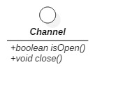
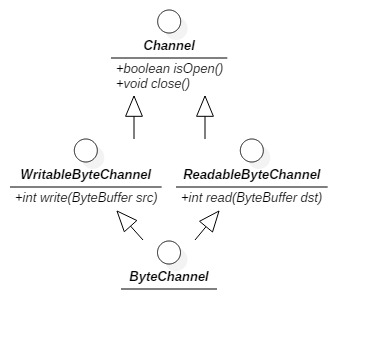
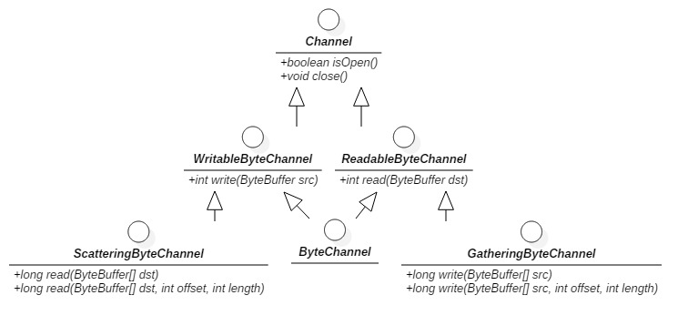
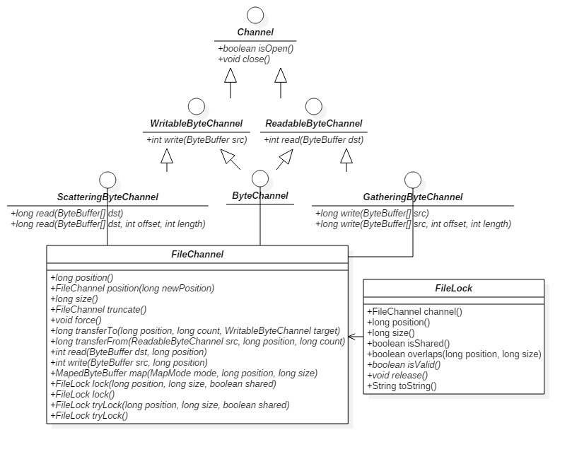

# java channel 基础
channel 一端连接着实体(文件或者socket) 一端连接着字节缓冲区buffer



使用通道，无论read还是write都是与一个ByteBuffer交互



# Scatter/Gather
又称为矢量IO，是指在多个缓冲区上实现一个简单的IO，对于一个write操作而言，数据是从几个缓冲区按顺序抽取(称为gather)并沿着通道发送的，该gather过程的效果就好比全部缓冲区的内容被连结起来，并在发送数据前存放到一个大的缓冲区中

对于read操作而言，从通道读取的数据会按顺序被散布(称为scatter)到多个缓冲区，将每个缓冲区填满直至通道中的数据或者缓冲区的最大空间被消耗完



# 文件通道 `FileChannel`


## 基础
在此`FileChannel`是阻塞式的，不能置于非阻塞模式，当然在nio.2中有异步的`FileChannel`，可以是异步非阻塞的

`FileChannel`可以通过`RandomAccessFile`、`FileInputStream`、`FileOutputStream`的`getChannel()`获得，在jdk1.5之后`FileChannel`有了两个静态方法`open(Path path, OpenOption... options)`和`open(Path path, Set<? extends OpenOption> options, FileAttribute<?>... attrs)`可以直接获取

FileChannel对象是线程安全(thread-safe)的。多个进程可以在同一个实例上并发调用方法而不会引起任何问题，不过并非所有的操作都是多线程的(multithreaded)。**影响通道位置或者影响文件大小的操作都是单线程的(single-threaded). 如果有一个线程已经在执行会影响通道位置或文件大小的操作，那么其他尝试进行此类操作之一的线程必须等待.**并发行为也会受到底层的操作系统或文件系统影响。

## 文件锁
1. 从`FileChannel`可以获得共享锁或者独占锁(但这取决于操作系统，如果操作系统不支持共享锁，那么即使请求共享锁获得的也是独占锁)
2. 从`FileChannel`获得文件锁`FileLock`锁对象不是通道或者线程，而是文件，换句话说，这个文件锁不能判优同一台jvm上多个线程对同个文件的访问，**如果一个线程在某个文件上获得了一个独占锁，然后第二个线程利用一个单独打开的通道来请求该文件的独占锁，那么第二个线程的请求会被批准**，但如果这两个线程运行在不同的Java虚拟机上，那么第二个线程会阻塞，因为第二个线程属于另外一个jvm进程，锁最终是由操作系统或文件系统来判优的并且几乎总是在进程级而非线程级上判优。**文件锁旨在在进程级别上判优文件访问，比如在主要的程序组件之间或者在集成其他供应商的组件时。如果您需要控制多个Java线程的并发访问，您可能需要实施您自己的、轻量级的锁定方案**

测试java
```java
public class FileLockTest {
    private static final int SIZEOF_INT = 4;
    private static final int INDEX_START = 0;
    private static final int INDEX_COUNT = 10;
    private static final int INDEX_SIZE = INDEX_COUNT * SIZEOF_INT;

    private ByteBuffer buffer = ByteBuffer.allocate(INDEX_SIZE);
    private IntBuffer indexBuffer = buffer.asIntBuffer();   //创建视图
    private int idVal = 0;
    private Random random = new Random();

    public static void main(String[] args) throws Exception{
        String filePath;
        boolean isWritable;
        Path path;
        FileChannel fc;
        FileLockTest fileLockTest = new FileLockTest();

        if (args.length != 2) {
            System.out.println("Usage: [ -r | -w ] filePath");
            return;
        }

        isWritable = args[0].equalsIgnoreCase("-w");
        filePath = args[1];
        path = Paths.get(filePath);
        if (Files.notExists(path, LinkOption.NOFOLLOW_LINKS)) {
            try {
                path = Files.createFile(path);
            } catch (IOException e) {
                e.printStackTrace();
            }
        }

        try {
            if (isWritable) {
                fc = FileChannel.open(path, StandardOpenOption.READ, StandardOpenOption.WRITE);
                fileLockTest.doUpdates(fc);
            }else {
                fc = FileChannel.open(path, StandardOpenOption.READ);
                fileLockTest.doQueries(fc);
            }
        } catch (IOException e) {
            e.printStackTrace();
        }
    }

    private void doUpdates(FileChannel fc) throws Exception{
        if (fc == null) {
            throw new IllegalArgumentException("FileChannel can't be null");
        }
        FileLock lock = null;
        while (true) {
            try{
                lock = fc.lock(INDEX_SIZE, INDEX_SIZE, false);
                indexBuffer.clear();
                for (int i = 0;i < INDEX_COUNT;i++) {
                    idVal++;
                    System.out.println("Updating index " + i + "=" + idVal);
                    indexBuffer.put(idVal);
                    TimeUnit.SECONDS.sleep(1);
                }
                buffer.clear();
                fc.write(buffer, INDEX_START);
            } finally {
                if (lock != null) {
                    lock.release();
                }
            }
            TimeUnit.SECONDS.sleep(random.nextInt(5) + 1L);
        }
    }

    private void doQueries(FileChannel fc) throws Exception{
        if (fc == null) {
            throw new IllegalArgumentException("FileChannel can't be null");
        }
        FileLock lock = null;
        while (true) {
            try {
                lock = fc.lock(INDEX_START, INDEX_SIZE, true);
                int reps = random.nextInt(60) + 20;
                for (int i = 0;i < reps;i++) {
                    int n = random.nextInt(INDEX_COUNT);
                    int position = INDEX_START + (n * SIZEOF_INT);
                    buffer.clear();
                    fc.read(buffer, position);
                    int value = indexBuffer.get(0);
                    System.out.println("Index entry " + n + "=" + value);
                    TimeUnit.SECONDS.sleep(1);
                }
            }finally {
                if (lock != null) {kz
                    lock.release();
                }
            }
            TimeUnit.SECONDS.sleep(random.nextInt(5) + 1L);
        }
    }


}
```

## 内存映射文件
> 程序使用的内存地址是逻辑地址(内虚拟内存)，通过映射表(页表)找到对应的物理地址，逻辑地址分页，物理内存分块，块=页大小 [内存分页，分段，段页式管理](http://blog.csdn.net/zephyr_be_brave/article/details/8944967)

[内存映射解释](http://blog.csdn.net/mg0832058/article/details/5890688)
在普通进行io的时候，不仅需要将磁盘上文件搬运到内核空间，还需要将数据从内核空间复制到用户空间，当文件修改的时候，依旧是要经过系统调用，io开销大(需要通过用户+内核空间交互)，而内存映射文件就是，用户进程要读取一个文件，会请求开辟一段虚拟内存空间，该空间映射到物理内存上，但是物理内存上现在不存在这个文件，找不到，产生缺页中断，内核将根据请求的文件，将数据直接搬运到(可能从磁盘上，也可能从磁盘的虚拟内存上,swap页面)用户虚拟内存映射的物理内存上，并且是按页对齐，也就是说这段物理内存上文件存在的形态与在磁盘上(文件系统上)是一样的，当修改产生时(内存上)，会发生脏读，内核直接会修改磁盘上文件脏读部分的内容，保证与内存上一样，用户进程就像是在内存上操纵磁盘上的文件

要注意的点**读入内存的文件是按页对齐的，也就是说就像冰箱里储冰的盒子，一格一格的，如何一格没放满，它还是占据了一格的位置，一般一个文件页的大小为4kb=4096b**

创建内存映射时需要指定`MapMode`，其中`MapMode.PRIVATE` 表示写时拷贝（copy-on-write）的映射，这意味着您通过put( )方法所做的任何修改都会导致产生一个私有的数据拷贝并且该拷贝中的数据只有MappedByteBuffer实例可以看到。
注意**写时拷贝是基于页的，复制整个被修改的页，但其他未修改内容的页是共享的，无论是通过其他映射修改，或直接修改文件，都是可见的**

与文件锁的范围机制不一样，映射文件的范围不应超过文件的实际大小。如果您请求一个超出文件大小的映射，文件会被增大以匹配映射的大小。假如您给size参数传递的值是`Integer.MAX_VALUE`，文件大小的值会膨胀到超过2.1GB。即使您请求的是一个只读映射，`map()`方法也会尝试这样做并且大多数情况下都会抛出一个`IOException`异常,因为底层的文件不能被修改。该行为同之前讨论的文件“空洞”的行为是一致的

同常规的文件句柄类似，文件映射可以是可写的或只读的。前两种映射模式`MapMode.READ_ONLY`和`MapMode.READ_WRITE`意义是很明显的，它们表示您希望获取的映射只读还是允许修改映射的文件。请求的映射模式将受被调用`map()`方法的`FileChannel`对象的访问权限所限制。如果通道是以只读的权限打开的而您却请求`MapMode.READ_WRITE`模式，那么`map()`方法会抛出一个`NonWritableChannelException`异常；如果您在一个没有读权限的通道上请求`MapMode.READ_ONLY`映射模式，那么将产生`NonReadableChannelException`异常。不过在以`read/write`权限打开的通道上请求一个`MapMode.READ_ONLY`映射却是允许的。MappedByteBuffer对象的可变性可以通过对它调用`isReadOnly()`方法来检查

**所有的MappedByteBuffer对象都是直接的，这意味着它们占用的内存空间位于Java虚拟机内存堆之外(并且可能不会算作Java虚拟机的内存占用，不过这取决于操作系统的虚拟内存模型)**


```java
public class FileMemoryMap2 {
    public static void main(String[] args) {
        RandomAccessFile file;
        FileChannel fc;
        ByteBuffer temp = ByteBuffer.allocate(100);
        MappedByteBuffer ro, rw, cow;
        try {
            file = new RandomAccessFile("data6", "rw");
        } catch (FileNotFoundException e) {
            e.printStackTrace();
            return;
        }

        fc = file.getChannel();
        try {
            temp.put("This is the file content".getBytes()).flip();
            fc.write(temp);
            temp.clear();
            temp.put("This is more file content".getBytes()).flip();
            //position is 8 KB, almost certainly a different memory/FS page
            fc.write(temp, 1024*8);
        } catch (IOException e) {
            e.printStackTrace();
        }

        try {
            ro = fc.map(FileChannel.MapMode.READ_ONLY, 0, fc.size());
            rw = fc.map(FileChannel.MapMode.READ_WRITE, 0, fc.size());
            cow = fc.map(FileChannel.MapMode.PRIVATE, 0, fc.size());
            //begin
            showBuffers("begin", ro, rw, cow);

            //modify cow
            cow.position(8);
            cow.put("COW".getBytes());
            showBuffers("change to COW buffer", ro, rw, cow);

            //modify rw
            rw.position(9);
            //cow will not change because copy a memory page for original page
            rw.put(" R/W ".getBytes());
            rw.position(8194);
            //cow will change because share the same original page
            rw.put(" R/W ".getBytes());
            rw.force();
            showBuffers("change to R/W buffer", ro, rw, cow);

            //modify channel
            temp.clear();
            temp.put(" Channel ".getBytes()).flip();
            fc.write(temp, 8194);
            showBuffers("change to Channel", ro, rw, cow);

        } catch (IOException e) {
            e.printStackTrace();
        }


    }

    private static void showBuffers(String notice, ByteBuffer... buffers) {
        // assume buffers=ro rw cow
        String[] prefixs = {"R/O", "R/W", "COW"};
        int i = 0;
        System.out.println(String.format("=============%s============", notice));
        for (ByteBuffer buffer: buffers) {
            dumpBuffer(prefixs[i++], buffer);
        }
        System.out.println();
    }

    private static void dumpBuffer(String prefix, ByteBuffer buffer) {
        if (prefix == null || prefix.isEmpty()) {
            prefix = "unknow";
        }
        if (buffer == null || !buffer.hasRemaining()) {
            System.out.println(prefix + ": null");
            return;
        }

        StringBuilder sbd = new StringBuilder(prefix + ": ");
        int nulls = 0;
        //limit equals file size, also equals to buffer capacity
        int limit = buffer.limit();
        //avoid changing the position of buffer, is clear to get all byte
        for (int i = 0;i < limit;i++) {
            char c = (char)buffer.get(i);
            if (c == '\u0000') {
                ++nulls;
                continue;
            }
            if (nulls > 0) {
                sbd.append(String.format("[... %d ...]", nulls));
                nulls = 0;
            }
            sbd.append(c);
        }
        System.out.println(sbd);
    }
}
/** output
 =============begin============
 R/O: This is the file content[... 8168 ...]This is more file content
 R/W: This is the file content[... 8168 ...]This is more file content
 COW: This is the file content[... 8168 ...]This is more file content

 =============change to COW buffer============
 R/O: This is the file content[... 8168 ...]This is more file content
 R/W: This is the file content[... 8168 ...]This is more file content
 COW: This is COW file content[... 8168 ...]This is more file content

 =============change to R/W buffer============
 R/O: This is t R/W le content[... 8168 ...]Th R/W  more file content
 R/W: This is t R/W le content[... 8168 ...]Th R/W  more file content
 COW: This is COW file content[... 8168 ...]Th R/W  more file content

 =============change to Channel============
 R/O: This is t R/W le content[... 8168 ...]Th Channel e file content
 R/W: This is t R/W le content[... 8168 ...]Th Channel e file content
 COW: This is COW file content[... 8168 ...]Th Channel e file content
 */
```


